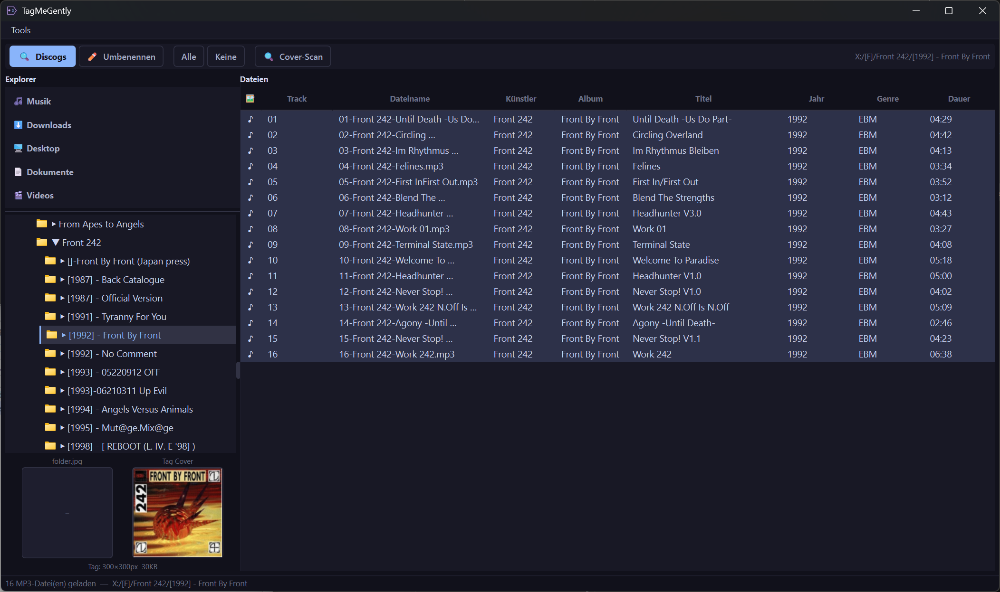
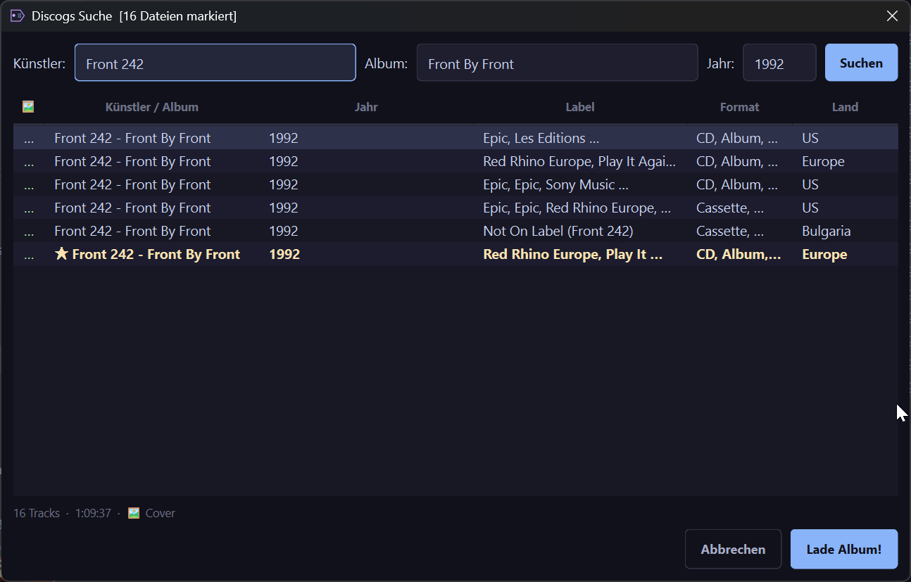
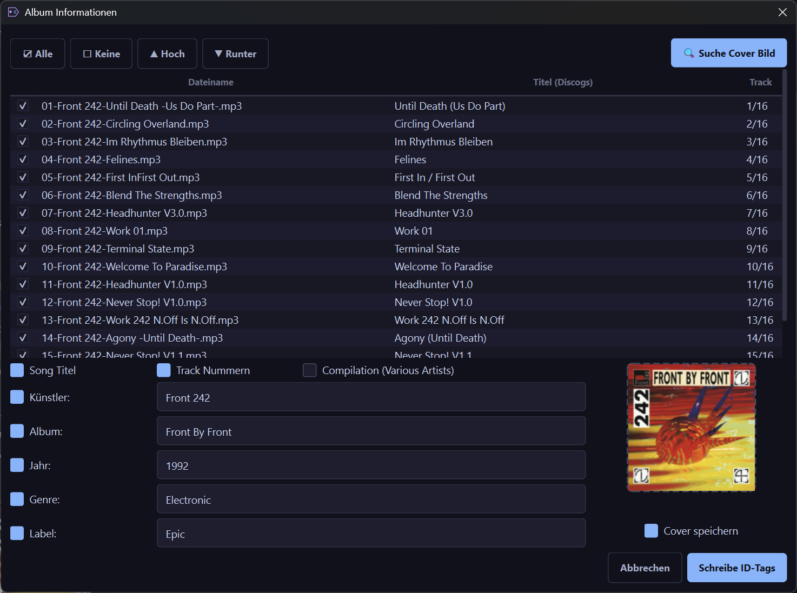
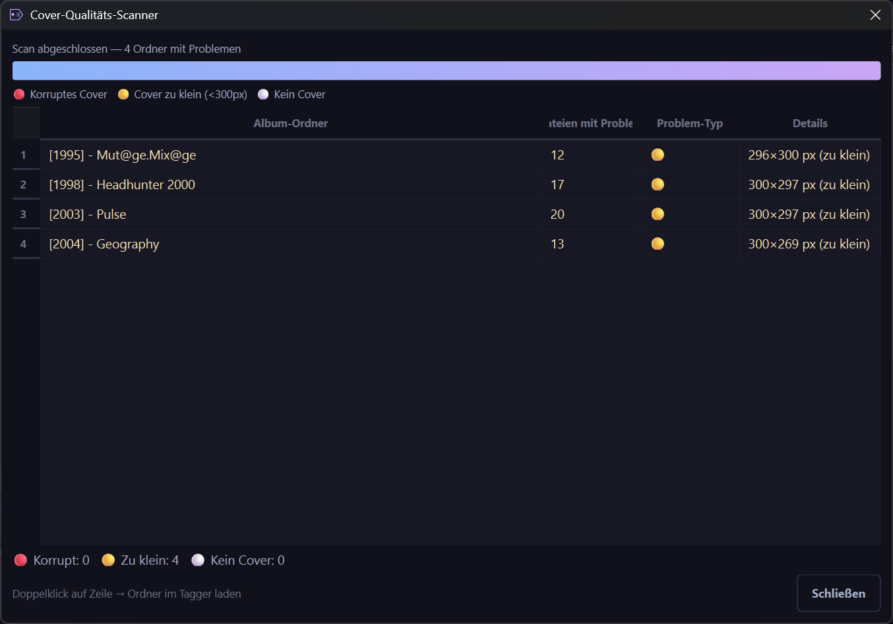
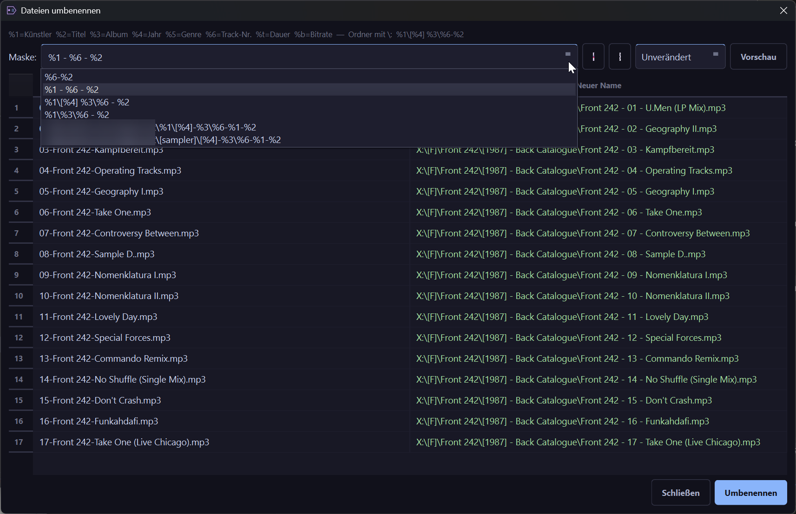

# TagMeGently

[](https://buymeacoffee.com/noyse27)

A modern MP3 tagger with Discogs integration — built as a replacement for Tag&Rename, fixing its UTF-8/special character encoding bug when fetching metadata from Discogs.


## Screenshots

### Main Window


### Discogs Search — with Master releases (★) and single-click detail preview


### TrackMatch Dialog — side-by-side file ↔ Discogs track matching


### Cover Quality Scanner


### File Renaming with absolute path masks


---

## Features

### Explorer & File List
- Special folder shortcuts (Musik, Downloads, Desktop, Dokumente, Videos) above the tree
- Full folder tree — single click expands, double click scans MP3s
- Files sorted by album → track number (natural sort)
- Cover column (♪) indicates embedded covers; click a file to preview its cover
- Dual cover panel: **folder.jpg** left, **tag cover** right
- "folder.jpg als Tag-Cover setzen" button — appears when folder.jpg exists but tag cover is missing

### Discogs Search
- Search by Artist + Album — returns both **releases and Master releases** (★ gold)
- Single click on result loads track count, total duration and cover status instantly
- Client-side album title filter — no false positives from track title matches
- Detail cache — no double-download when browsing results

### TrackMatch Dialog
- Local filenames and Discogs tracklist shown side by side
- ▲/▼ moves **files OR Discogs tracks independently** — click the column to choose side
- `Datei nicht gefunden!` in red when Discogs has more tracks than local files
- **Compilation auto-detection** — per-track artists from Discogs API → `Title /// Artist` format → splits title/artist, sets Album Artist = "Various Artists"
- **Master releases** automatically load their main release for full label/country data
- **Drag & drop cover** from browser directly into the cover field
- **Google Images search** button opens browser pre-filled with artist/album/year

### BPM Calculation
- **♩ BPM** button calculates beats per minute via librosa beat detection
- Runs in background thread — UI stays responsive
- Loads max 60 seconds per file for speed (sufficient for accurate detection)
- Skips files that already have a BPM tag

### Configurable File Table
- Columns **Album Artist** and **BPM** shown by default
- Optional columns (hidden by default): Bitrate, Kommentar, Label, Disc#
- **Right-click any column header** to show/hide columns
- **Drag & drop** columns to reorder — layout persists across sessions

### Tag Writing
- Correct UTF-8 encoding via mutagen (fixes the Ö/Ü/Ä and Cyrillic bug in Tag&Rename)
- Corrupt APIC frames fully replaced, not stacked
- **Album Artist (TPE2)** always written alongside Artist
- Cover resized to max 600×600 px via Pillow
- `folder.jpg` written to album folder alongside tags

### Cover Quality Scanner
- Scans folder tree recursively, checks every embedded cover via full Pillow decode
- Categories: 🔴 Corrupt · 🟡 Too small (<300px) · ⚪ No cover
- Activated as soon as any folder is selected in the tree — uses selected folder as root
- Double-click any result to load that album directly in the tagger

### File Renaming
- Mask-based renaming with persistent custom masks (save/delete per mask)
- **Absolute path masks** — `I:\Musik\%1\[%4] %3\%6-%2` moves files to any drive/folder
- Before renaming: extracts cover from first MP3 tag and saves as `folder.jpg` if none exists
- `folder.jpg` copied to all destination folders when files are moved

### Background Scanning
- Folder scan runs in background thread — UI stays fully responsive
- Cancel button (✕) visible during scan
- Scan ID mechanism — stale results from cancelled scans are discarded

---

## Installation

```bash
pip install PyQt6 mutagen requests Pillow
python tagger.py
```

Or download `TagMeGently.exe` from [Releases](https://github.com/noyse27/tagmegently/releases) — no Python required.

## Discogs API Token

1. Go to [discogs.com → Settings → Developers](https://www.discogs.com/settings/developers)
2. Click **Generate new token**
3. In TagMeGently: **Tools → Einstellungen** → paste the token

With token: 60 requests/min · without: 25/min

## Rename Mask Variables

| Variable | Value        |
|----------|-------------|
| `%1`     | Artist       |
| `%2`     | Title        |
| `%3`     | Album        |
| `%4`     | Year         |
| `%5`     | Genre        |
| `%6`     | Track number |
| `%t`     | Duration     |
| `%b`     | Bitrate      |

Use `\` to create subfolders: `%1\[%4] %3\%6 - %2`  
Use an absolute path to move files: `I:\Musik\%1\[%4] %3\%6 - %2`

## Requirements

- Python 3.10+
- PyQt6 >= 6.6
- mutagen >= 1.47
- requests >= 2.31
- Pillow >= 10.0

## Changelog

### v1.3
- **Tag editor** — double-click or right-click any file → edit all tags in a dedicated dialog
- **Batch tag editor** — select multiple files, right-click → fields default to `<beibehalten>` (keep), confirmation before writing
- Discogs artist names: disambiguation numbers stripped automatically (`Artist (2)` → `Artist`)
- Discogs comments/notes loaded into TrackMatch and written to COMM tag
- Files sorted by track tag (or filename) before passing to Discogs TrackMatch
- Rename dialog: preview auto-updates when mask changes
- Table columns: interactive resize (drag border), horizontal scrollbar when needed
- Selection preserved after tag write, BPM calculation, rename

### v1.2
- BPM calculation button (♩ BPM) — librosa beat detection, background thread, skips existing BPM tags
- Album Artist and BPM as new default-visible table columns
- Optional columns: Bitrate, Kommentar, Label, Disc# (right-click header to toggle)
- Drag & drop column reordering, persisted across sessions

### v1.1
- Quick rename button (⚡) — applies last saved mask instantly without dialog; tooltip shows current mask
- Auto-numbering button (#) — writes sequential track numbers to selected files with smart zero-padding
- About dialog (Über menu) with version, copyright, website and contact links

### v0.4
- Compilation auto-detection via Discogs per-track artist API field
- Master releases now load correctly (via main_release_url)
- Discogs search includes both releases and masters; client-side album filter
- Cover-Scan enabled from tree selection (no folder scan required first)
- Rename: auto-creates folder.jpg from tag cover before renaming
- Various crash fixes for network drives

### v0.3
- Explorer with special folder shortcuts (Musik, Downloads, Desktop etc.)
- Background folder scan with cancel button; scan ID for stale result prevention
- Dual cover panel (folder.jpg + tag cover); folder.jpg → tag button
- QFileSystemModel with DontWatchForChanges — no network drive crashes
- ▶/▼ text arrows via QStyledItemDelegate

### v0.2
- TrackMatch dialog (Tag&Rename-style workflow)
- Drag & drop cover from browser
- Album Artist (TPE2) tag
- Absolute path rename masks + folder.jpg copied on move

### v0.1
- Initial release: Explorer tree, Discogs search, Cover Quality Scanner, mask-based renaming

## Support

If TagMeGently saves you time, consider buying me a coffee ☕

[](https://buymeacoffee.com/noyse27)

## License

MIT
